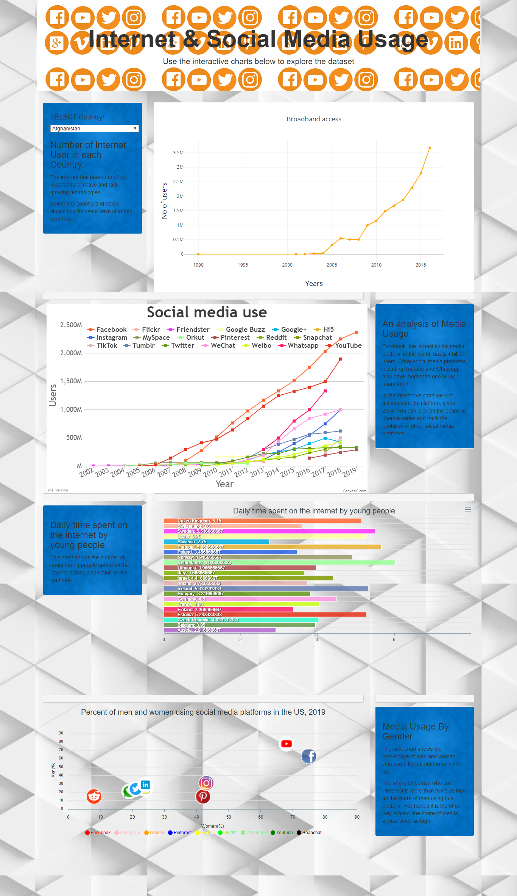

# Internet and Social Media Usage

In this project we built an interactive dashboard to explore the Internet and Social Media Usage DataSet on the basis of country, social networking site and gender.

In this project we used falsk for the API and different javascript libraries to build an interactive charts for the dashboard, Plotly.js , APEXChart and Canvas.js.

Deployed Flask app to Heroku here: https://social-netwoking.herokuapp.com/ Used sqlite file for the database.

Below is a screenshot of the website. 

